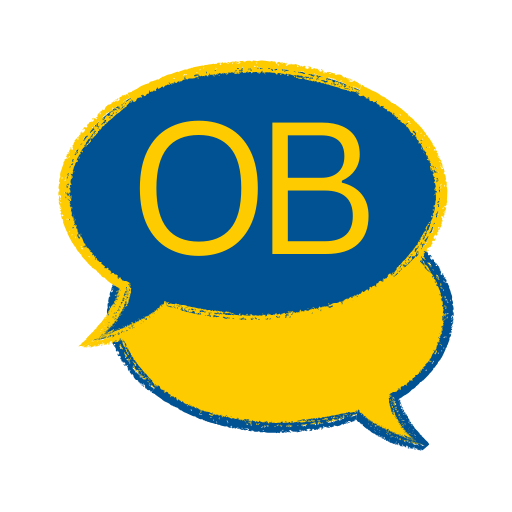

#  OrdBank


A vocabulary learning application built with **Next.js**, **Neon PostgreSQL** and **Drizzle ORM**.

Currently in development, this app will allow language learners to test themselves on the vocabulary they find most challenging.

## Contents

- ✨ [Features](#-features)
- 🛠 [Tech stack](#-tech-stack)
- ⚙️ [Installation for development](#️-installation-for-development)
- 📂 [Project structure](#-project-structure)
- 🧩 [Contributing](#-contributing)
- 📜 [Licence](#-licence)

## ✨ Features

- **Vocabulary Management:** add, edit and delete vocabulary entries with source language terms and translations
- **Interactive testing:** Multiple testing modes, including typing and multiple choice (Planned)
- **Flexible Practice:** Set time limits, question counts or unlimited practice sessions (Planned)
- **Adaptive Learning:** Words you struggle with most feature more heavily in tests (Planned)

## 🛠 Tech stack

#### Core Framework & Language

- **[Next.js 15 (App Router)](https://nextjs.org/docs)** - React framework for server-side rendering, routing, and modern app architecture
- **[TypeScript](https://www.typescriptlang.org/)** - Type-safe JavaScript for improved developer experience and code reliability

#### Database & ORM

- **[PostgresSQL](https://www.postgresql.org/)** - Powerful, open-source relational database
- **[Neon](https://neon.com/)** - Serverless PostgreSQL platform with branching and autoscaling
- **[Drizzle ORM](https://orm.drizzle.team/)** - TypeScript-first ORM for type-safe database queries and migrations

#### Styling & UI

- **[Tailwind CSS](https://tailwindcss.com/docs/styling-with-utility-classes)** - Utility-first CSS framework for responsive design
- **[shadcn/ui](https://ui.shadcn.com/docs)** - Composable UI component library built on Radix UI
- **[Radix UI](https://www.radix-ui.com/primitives/docs/overview/introduction)** - Unstyled, accessible component primitives
- **[Lucide React](https://lucide.dev/icons/)** - Modern icon library

#### Features & Functionality

- **[Zod](https://zod.dev/)** - Runtime type validation for forms and data schemas
- **[Clerk](https://clerk.com/)** - Authentication and protected routes
- **[React Hot Toast](https://react-hot-toast.com/)** - Toast notification system for user feedback

#### Development Tools

- **[ESLint](https://eslint.org/) & [Prettier](https://prettier.io/)** - Code linting and formatting for consistent code style
- **[Husky](https://typicode.github.io/husky/)** - Git hooks for automated pre-commit quality checks

## ⚙️ Installation for development

### Pre-requisites

- Node.js (version 20 or higher recommended)
- **npm** or **yarn** package manager
- Neon PostgreSQL database

### Steps

1. Clone the repository:

   ```bash
   git clone https://github.com/jplimmer/ordbank.git
   cd ordbank
   ```

2. Install dependencies:

   ```bash
   npm install
   ```

3. Add your neon database connection to your `.env` file (see [`.env.example`](.env.example)):

   ```
   DATABASE_URL=your_neon_connection_string
   ```

4. Start the development server:

   ```bash
   npm run dev
   ```

5. Open [http://localhost:3000](http://localhost:3000) with your browser to see the application.

## 📂 Project structure

```
ordbank/
├── src/
│   ├── app/               # Next.js App Router pages and routes
│   │   ├── @modal/        # Parallel slot for intercepting modal routes
│   │   ├── test/
│   │   ├── user-guide/
│   │   ├── vocab/
│   │   ├── globals.css
│   │   ├── layout.tsx
│   │   └── page.tsx
│   ├── components/        # Reusable React components organised by feature
│   └── lib/
│       ├── actions/       # Server actions
│       ├── constants/
│       ├── db/            # Database schema and configuration
│       ├── services/      # Database operations
│       ├── types/
│       ├── validation/    # Zod validation schemas
│       ├── logger.ts
│       └── utils.ts
├── public/                # Static assets
├── package.json
└── README.md
```

## 🧩 Contributing

This is currently a personal project, but I'm open to contributions! If you'd like to contribute:

1. Fork the repository.

2. Create a feature branch:

   ```bash
   git checkout -b feature/my-new-feature
   ```

3. Make your changes and commit them:

   ```bash
   git add .
   git commit -m "Add my new feature"
   ```

4. Push your changes to your forked repository:

   ```bash
   git push origin feature/my-new-feature
   ```

5. Open a pull request from your fork to the main repository.

## 📜 Licence

This project is private and not currently licensed for public use.
