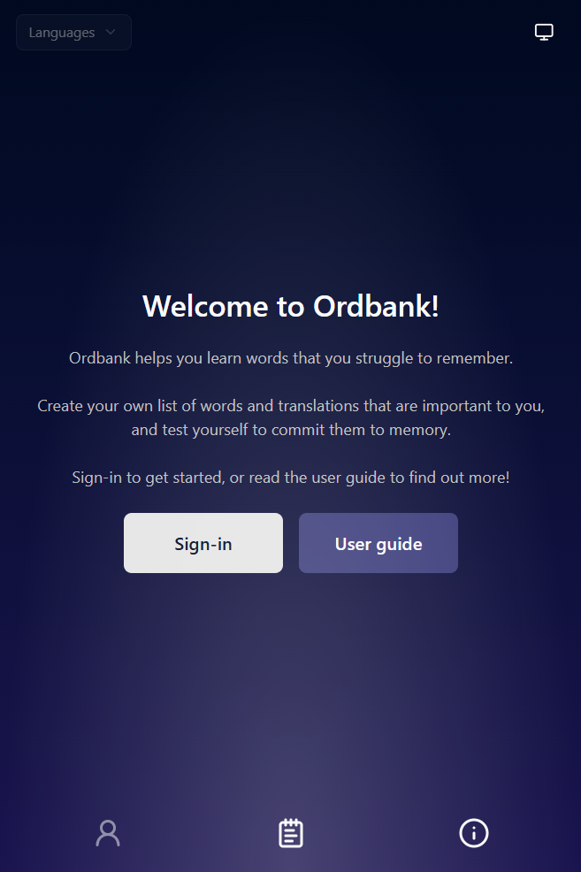
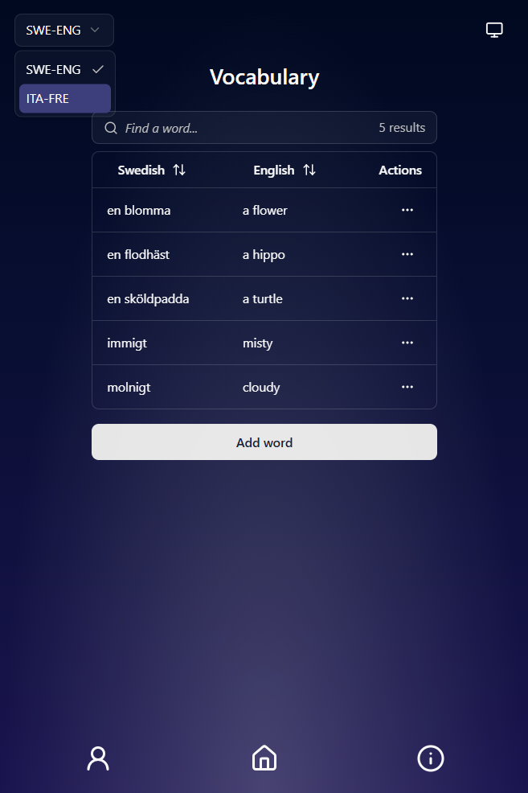
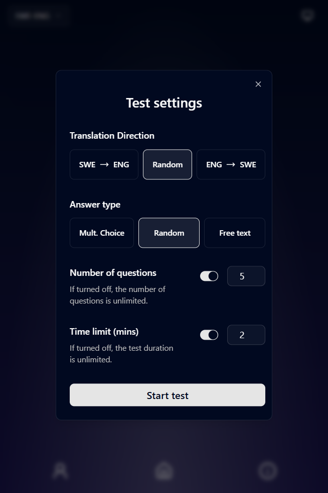
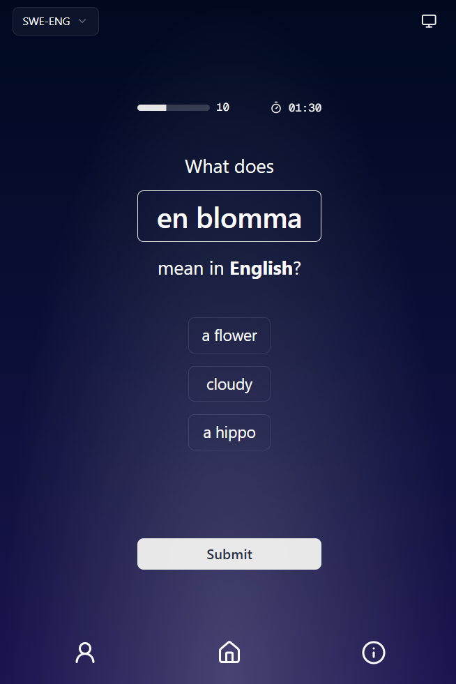

#  Ordbank


A lightweight, mobile-first vocabulary learning app built with **Next.js & React**, **Neon PostgreSQL** and **Drizzle ORM**.

Create custom word lists for any language pair, then test yourself on the go. The app focuses on words you find challenging, making practice sessions more effective. Designed for learners who want control over what they study — no pre-made decks, just your vocabulary.

## Contents

- ✨ [Features](#-features)
- 🖼️ [Screenshots](#️-screenshots)
- 🛠 [Tech stack](#-tech-stack)
- ⚙️ [Installation for development](#️-installation-for-development)
- 📂 [Project structure](#-project-structure)
- 🧩 [Contributing](#-contributing)
- 📜 [Licence](#-licence)

## ✨ Features

- **Custom vocabulary lists** - Add your own words and translations for any language pair
- **Multi-language support** - Manage multiple language pairs (e.g., Swedish-English, Italian-French) with easy switching
- **Smart testing** - Adaptive question selection that prioritizes words you struggle with
- **Flexible test options**
  - Choose translation direction (source-to-target, target-to-source, or random)
  - Multiple choice (3 options) or typed answers
  - Optional question and time limits

## 🖼️ Screenshots

<table>
    <tr>
        <td width="50%">
            
            <i>Landing page</i>
        </td>
        <td width="50%">
            
            <i>Vocabulary page with open language select</i>
        </td>
    </tr>
    <tr>
        <td width="50%">
            
            <i>Test settings</i>
        </td>
        <td width="50%">
            
            <i>Example test question</i>
        </td>
    </tr>
</table>

## 🛠 Tech stack

#### Core Framework & Language

- **[Next.js 15 (App Router)](https://nextjs.org/docs)** - React framework for server-side rendering, routing, and modern app architecture
- **[TypeScript](https://www.typescriptlang.org/)** - Type-safe JavaScript for improved developer experience and code reliability

#### Database & ORM

- **[PostgresSQL](https://www.postgresql.org/)** - Powerful, open-source relational database
- **[Neon](https://neon.com/)** - Serverless PostgreSQL platform with branching and autoscaling
- **[Drizzle ORM](https://orm.drizzle.team/)** - TypeScript-first ORM for type-safe database queries and migrations

#### Styling & UI

- **[Tailwind CSS](https://tailwindcss.com/docs/styling-with-utility-classes)** - Utility-first CSS framework for responsive design
- **[shadcn/ui](https://ui.shadcn.com/docs)** - Composable UI component library built on Radix UI
- **[Radix UI](https://www.radix-ui.com/primitives/docs/overview/introduction)** - Unstyled, accessible component primitives
- **[Lucide React](https://lucide.dev/icons/)** - Modern icon library

#### Features & Functionality

- **[Clerk](https://clerk.com/)** - Authentication and protected routes
- **[Zod](https://zod.dev/)** - Runtime type validation for forms and data schemas
- **[React Hot Toast](https://react-hot-toast.com/)** - Toast notification system for user feedback

#### Development Tools

- **[ESLint](https://eslint.org/) & [Prettier](https://prettier.io/)** - Code linting and formatting for consistent code style
- **[Husky](https://typicode.github.io/husky/)** - Git hooks for automated pre-commit quality checks

## ⚙️ Installation for development

### Pre-requisites

- Node.js (version 20 or higher recommended)
- Node package manager (e.g. **npm** or **yarn**)
- [Neon](https://console.neon.tech/app/) PostgreSQL database
- [Clerk](https://dashboard.clerk.com/apps) project

### Steps

1. Clone the repository:

   ```bash
   git clone https://github.com/jplimmer/ordbank.git
   cd ordbank
   ```

2. Install dependencies:

   ```bash
   npm install
   ```

3. Add your neon database connection and clerk keys to your `.env` file, and copy the below clerk sign-in redirects (see [`.env.example`](.env.example)):

   ```properties
   # Neon database connection
   DATABASE_URL=your_neon_connection_string

   # Clerk project keys
   NEXT_PUBLIC_CLERK_PUBLISHABLE_KEY=pk_your_clerk_public_key
   CLERK_SECRET_KEY=sk_your_clerk_secret_key

   # Clerk sign-in redirects
   NEXT_PUBLIC_CLERK_SIGN_IN_URL=/sign-in
   NEXT_PUBLIC_CLERK_SIGN_IN_FALLBACK_REDIRECT_URL=/
   NEXT_PUBLIC_CLERK_SIGN_UP_FALLBACK_REDIRECT_URL=/
   ```

4. Start the development server:

   ```bash
   npm run dev
   ```

5. Open [http://localhost:3000](http://localhost:3000) with your browser to see the application.

## 📂 Project structure

```
ordbank/
├── src/
│   ├── app/               # Next.js App Router pages and routes
│   │   ├── @modal/        # Parallel slot for intercepting modal routes
│   │   ├── languages/
│   │   ├── sign-in/
│   │   ├── test/
│   │   ├── user-guide/
│   │   ├── vocabulary/
│   │   ├── globals.css
│   │   ├── layout.tsx
│   │   └── page.tsx
│   ├── components/        # Reusable React components organised by feature
│   ├── contexts/          # React contexts for global UI state
│   ├── hooks/
│   ├── lib/
│   |   ├── actions/       # Server actions organised by feature
│   |   ├── constants/
│   |   ├── db/            # Database schema and configuration
│   |   ├── services/      # Database and authentication operations
│   |   ├── types/
│   |   ├── validation/    # Zod validation schemas
│   |   ├── logger.ts
│   |   └── utils.ts
│   └── middleware.ts      # Clerk configuration
├── public/                # Static assets
├── package.json
└── README.md
```

## 🧩 Contributing

This is currently a personal project, but I'm open to contributions! If you'd like to contribute:

1. Fork the repository.

2. Create a feature branch:

   ```bash
   git checkout -b feature/my-new-feature
   ```

3. Make your changes and commit them:

   ```bash
   git add .
   git commit -m "Add my new feature"
   ```

4. Push your changes to your forked repository:

   ```bash
   git push origin feature/my-new-feature
   ```

5. Open a pull request from your fork to the main repository.

## 📜 Licence

This project is private and not currently licensed for public use.
