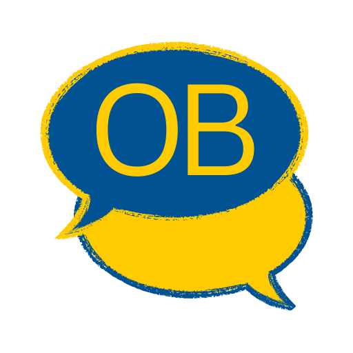
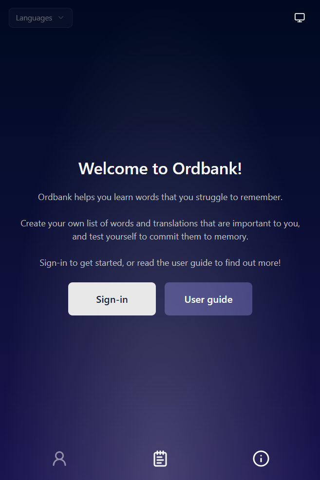
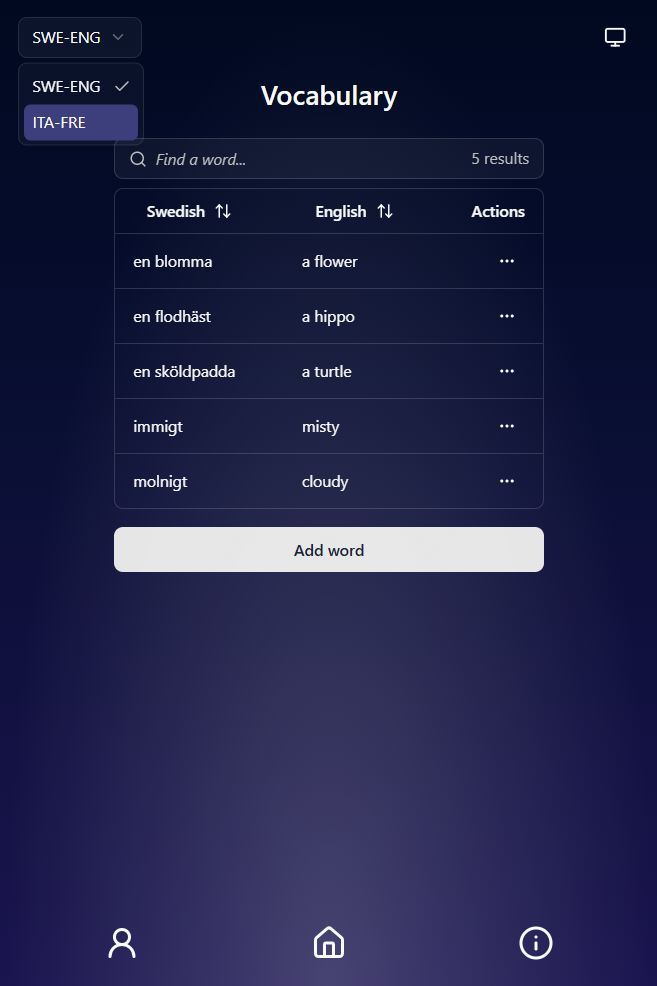
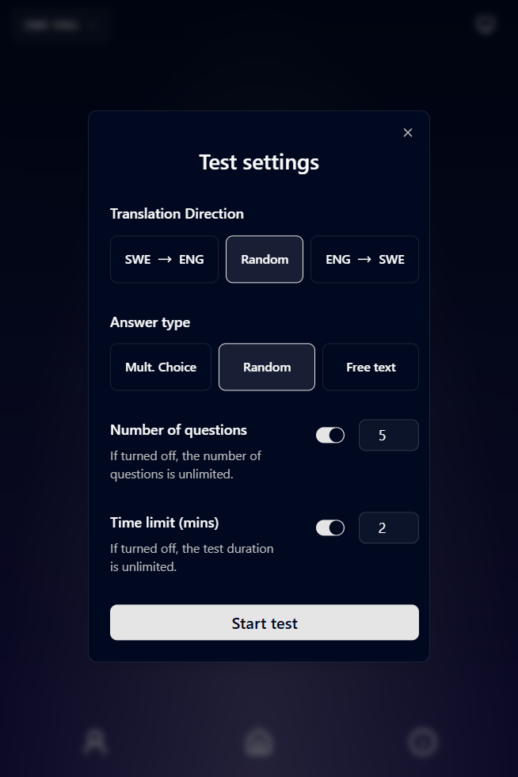
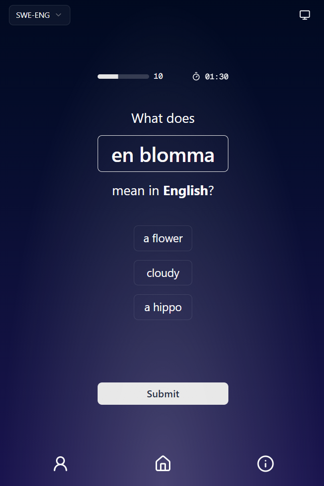

#  Ordbank


A lightweight, mobile-first vocabulary learning app built with **Next.js 15 & React 19**, **Neon PostgreSQL** and **Drizzle ORM**. Install it as a **PWA** for a native app experience.

Create custom word lists for any language pair, then test yourself on the go. The app focuses on words you find challenging, making practice sessions more effective. Designed for learners who want control over what they study — no pre-made decks, just your vocabulary.

## Contents

- ✨ [Features](#-features)
- 🖼️ [Screenshots](#️-screenshots)
- 🛠 [Tech stack](#-tech-stack)
- ⚙️ [Development](#️-development)
- 📂 [Project structure](#-project-structure)
- 🚀 [Future development](#-future-development)
- 🧩 [Contributing](#-contributing)
- 📜 [Licence](#-licence)

## ✨ Features

- **Custom vocabulary lists** - Add your own words and translations for any language pair
- **Multi-language support** - Manage multiple language pairs (e.g., Swedish-English, Italian-French) with easy switching
- **Smart testing** - Adaptive question selection that prioritizes words you struggle with
- **Flexible test options**
  - Choose translation direction (source-to-target, target-to-source, or random)
  - Multiple choice (3 options) or typed answers
  - Optional question and time limits
- **Progressive Web App (PWA)** - Install on your device for a native app experience with offline support

## 🖼️ Screenshots

<table>
    <tr>
        <td width="50%">
            
            <i>Landing page</i>
        </td>
        <td width="50%">
            
            <i>Vocabulary page with open language select</i>
        </td>
    </tr>
    <tr>
        <td width="50%">
            
            <i>Test settings</i>
        </td>
        <td width="50%">
            
            <i>Example test question</i>
        </td>
    </tr>
</table>

## 🛠 Tech stack

#### Core Framework & Language

- **[Next.js 15 (App Router)](https://nextjs.org/docs)** - React framework for server-side rendering, routing, and modern app architecture
- **[TypeScript](https://www.typescriptlang.org/)** - Type-safe JavaScript for improved developer experience and code reliability

#### Database & ORM

- **[PostgresSQL](https://www.postgresql.org/)** - Powerful, open-source relational database
- **[Neon](https://neon.com/)** - Serverless PostgreSQL platform with branching and autoscaling
- **[Drizzle ORM](https://orm.drizzle.team/)** - TypeScript-first ORM for type-safe database queries and migrations

#### Styling & UI

- **[Tailwind CSS](https://tailwindcss.com/docs/styling-with-utility-classes)** - Utility-first CSS framework for responsive design
- **[shadcn/ui](https://ui.shadcn.com/docs)** - Composable UI component library built on Radix UI
- **[Radix UI](https://www.radix-ui.com/primitives/docs/overview/introduction)** - Unstyled, accessible component primitives
- **[Lucide React](https://lucide.dev/icons/)** - Modern icon library

#### Features & Functionality

- **[Clerk](https://clerk.com/)** - Authentication and protected routes
- **[Zod](https://zod.dev/)** - Runtime type validation for forms and data schemas
- **[React Hot Toast](https://react-hot-toast.com/)** - Toast notification system for user feedback

#### Development Tools

- **[ESLint](https://eslint.org/) & [Prettier](https://prettier.io/)** - Code linting and formatting for consistent code style
- **[pnpm](https://pnpm.io/)** - Package manager with strict dependency isolation
- **[just](https://just.systems/)** - Task runner for local development and CI
- **[Husky](https://typicode.github.io/husky/)** - Git hooks for automated pre-commit quality checks

## ⚙️ Development

Requires Node 24 (via [fnm](https://github.com/Schniz/fnm)), [pnpm](https://pnpm.io/) and [just](https://just.systems/), plus a Neon database and a Clerk application.

```bash
git clone https://github.com/jplimmer/ordbank.git
cd ordbank
just install
cp .env.example .env.local   # then fill in your Neon and Clerk values
just dev
```

See [docs/development.md](docs/development.md) for the full setup, all commands and how dependencies and deployments work.

## 📂 Project structure

```
ordbank/
├── src/
│   ├── app/               # Next.js App Router pages and routes
│   │   ├── @modal/        # Parallel slot for intercepting modal routes
│   │   ├── languages/
│   │   ├── sign-in/
│   │   ├── test/
│   │   ├── user-guide/
│   │   ├── vocabulary/
│   │   ├── globals.css
│   │   ├── layout.tsx
│   │   └── page.tsx
│   ├── components/        # Reusable React components organised by feature
│   ├── contexts/          # React contexts for global UI state
│   ├── hooks/
│   ├── lib/
│   |   ├── actions/       # Server actions organised by feature
│   |   ├── constants/
│   |   ├── db/            # Database schema and configuration
│   |   ├── services/      # Database and authentication operations
│   |   ├── types/
│   |   ├── validation/    # Zod validation schemas
│   |   ├── logger.ts
│   |   └── utils.ts
│   └── middleware.ts      # Clerk configuration
├── public/                # Static assets
├── package.json
└── README.md
```

## 🚀 Future development

Potential features and improvements include:

- **Automatic word forms** - Integration with language APIs to automatically generate conjugations, declensions, and grammatical variations (plural forms, verb tenses, etc.) from a single word entry
- **Import/export** - allow users to backup and share word lists
- **Audio pronunciation** - speech-to-text and vice-versa for vocabulary practice

## 🧩 Contributing

This is a personal project. Bug reports and suggestions are welcome as [issues](https://github.com/jplimmer/ordbank/issues).

## 📜 Licence

This project is private and not currently licensed for public use.
